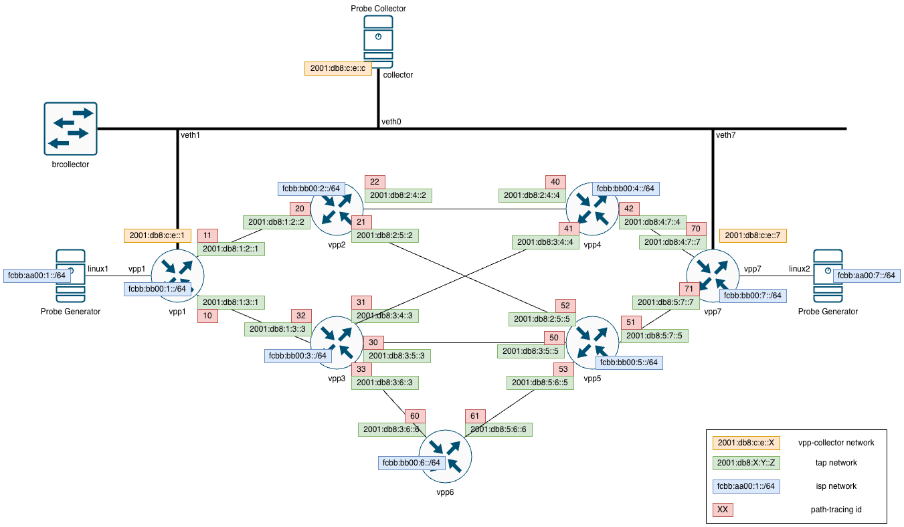

# VPP Path Tracing Improvement Project - IETF 117 Hackathon

This repository contains the code, documentation, and additional resources for our team's project at the IETF 117 Hackathon in San Francisco, where we aim to enhance the Vector Packet Processing (VPP) platform to better support Path Tracing.

## 🎯 Goals

Our goals for this hackathon are:

1. **Implement source node behavior in VPP mainline**: We plan to enhance the current mainline VPP by incorporating the Path Tracing source node behavior.
   
2. **Develop API functions for source node behavior**: This goal involves developing robust API functions to facilitate easy interaction with the newly incorporated source node behavior.
   
3. **End-to-end testing of Path Tracing on VPP**: We aim to perform comprehensive end-to-end testing—from probe generator to probe collector—to ensure that Path Tracing is operating as expected on the VPP platform.
   
4. **Improve batch processing in the midpoint behavior**: Our final goal is to optimize the efficiency and performance of batch processing within the midpoint behavior, facilitating faster and more effective packet handling.

## 🧰 Tools

For this project, we'll primarily use:

- Vector Packet Processing (VPP)
- C programming language (for VPP development)
- Go programming language (for API testing)
- Unix-based development environment
- Git for version control

## 👥 Team

- Laurent Metzger
- Severin Dellsperger
- Julian Klaiber

## 📚 Resources

- [Vector Packet Processing (VPP) documentation](https://fd.io/docs/vpp/)
- [IETF 117 Hackathon](https://www.ietf.org/how/runningcode/hackathons/117-hackathon/)

## Network Overview

